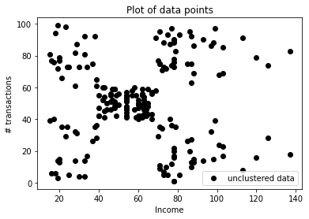
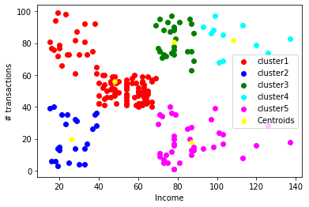
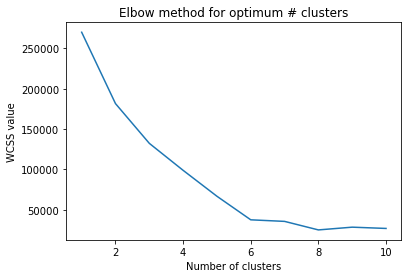

# K-means Cluster


```python
import pandas as pd
import numpy as np
import matplotlib.pyplot as plt
```


```python
dataset = pd.read_csv('Mall_Customers.csv')
dataset.describe()
```


<div>
<style scoped>
    .dataframe tbody tr th:only-of-type {
        vertical-align: middle;
    }

    .dataframe tbody tr th {
        vertical-align: top;
    }

    .dataframe thead th {
        text-align: right;
    }
</style>
<table border="1" class="dataframe">
  <thead>
    <tr style="text-align: right;">
      <th></th>
      <th>CustomerID</th>
      <th>Age</th>
      <th>Annual Income (k$)</th>
      <th>Spending Score (1-100)</th>
    </tr>
  </thead>
  <tbody>
    <tr>
      <th>count</th>
      <td>200.000000</td>
      <td>200.000000</td>
      <td>200.000000</td>
      <td>200.000000</td>
    </tr>
    <tr>
      <th>mean</th>
      <td>100.500000</td>
      <td>38.850000</td>
      <td>60.560000</td>
      <td>50.200000</td>
    </tr>
    <tr>
      <th>std</th>
      <td>57.879185</td>
      <td>13.969007</td>
      <td>26.264721</td>
      <td>25.823522</td>
    </tr>
    <tr>
      <th>min</th>
      <td>1.000000</td>
      <td>18.000000</td>
      <td>15.000000</td>
      <td>1.000000</td>
    </tr>
    <tr>
      <th>25%</th>
      <td>50.750000</td>
      <td>28.750000</td>
      <td>41.500000</td>
      <td>34.750000</td>
    </tr>
    <tr>
      <th>50%</th>
      <td>100.500000</td>
      <td>36.000000</td>
      <td>61.500000</td>
      <td>50.000000</td>
    </tr>
    <tr>
      <th>75%</th>
      <td>150.250000</td>
      <td>49.000000</td>
      <td>78.000000</td>
      <td>73.000000</td>
    </tr>
    <tr>
      <th>max</th>
      <td>200.000000</td>
      <td>70.000000</td>
      <td>137.000000</td>
      <td>99.000000</td>
    </tr>
  </tbody>
</table>
</div>


```python
X = dataset.iloc[:, [3, 4]].values
```


```python
m = X.shape[0] # number of training examples
n = X.shape[1] # number of features. n = 2

n_iter = 100
```


```python
K = 5 # number of clusters considered to be 5
Centroids = np.array([]).reshape(n, 0)
```


```python
idx = np.random.randint(0, m-1, size=K)
Centroids = X[idx, :]
print(Centroids)
```

    [[42 52]
     [38 35]
     [73 73]
     [76 87]
     [75  5]]
    


```python
for _ in range(n_iter):
    distance = np.array([]).reshape(m, 0)
    for k in range(K):
        tempDist = np.sum((X-Centroids[k, :])**2, axis=1)
        distance = np.c_[distance, tempDist]

    C = np.argmin(distance, axis=1)+1

    Y = {}
    for k in range(K):
        Y[k+1] = np.array([]).reshape(n, 0)
    for i in range(m):
        Y[C[i]] = np.c_[Y[C[i]], X[i]]

        # Regrouping to nearby centroids
    for k in range(K):
        Y[k+1] = Y[k+1].T

    for k in range(K):
        Centroids[k,:] = np.mean(Y[k+1], axis=0)
    Output = Y
```


```python
plt.scatter(X[:,0], X[:,1], c='black',label='unclustered data')
plt.xlabel('Income')
plt.ylabel('# transactions')
plt.legend()
plt.title('Plot of data points')
plt.show()
```


    

    


```python
color = ['red', 'blue', 'green', 'cyan', 'magenta']
labels = ['cluster' + str(i+1) for i in range(K)]
for k in range(K):
    plt.scatter(Output[k+1][:,0], Output[k+1][:,1], c=color[k], label=labels[k])
plt.scatter(Centroids[:,0], Centroids[:,1],s=30, c='yellow',label='Centroids')
plt.xlabel('Income')
plt.ylabel('# transactions')
plt.legend()
plt.show()
```


    

    


```python
def Kmeans(X, K, n_iter):
    Centroids = np.array([]).reshape(n, 0)
    idx = np.random.randint(0, m-1, size=K)
    Centroids = X[idx, :]
    for _ in range(n_iter):
        distance = np.array([]).reshape(m, 0)
        for k in range(K):
            tempDist = np.sum((X-Centroids[k, :])**2, axis=1)
            distance = np.c_[distance, tempDist]

        C = np.argmin(distance, axis=1)+1

        Y = {}
        for k in range(K):
            Y[k+1] = np.array([]).reshape(n, 0)
        for i in range(m):
            Y[C[i]] = np.c_[Y[C[i]], X[i]]

            # Regrouping to nearby centroids
        for k in range(K):
            Y[k+1] = Y[k+1].T

        for k in range(K):
            Centroids[k,:] = np.mean(Y[k+1], axis=0)
        Output = Y
    return Output, Centroids
```


```python
WCSS_array = []
for K in range(1,11):
    Output, Centroids = Kmeans(X,K,n_iter)
    wcss = 0
    for k in range(K):
        wcss += np.sum((Output[k+1] - Centroids[k,:])**2)
    WCSS_array.append(wcss)
```


```python
K_array = np.arange(1,11,1)
plt.plot(K_array, WCSS_array)
plt.xlabel('Number of clusters')
plt.ylabel('WCSS value')
plt.title('Elbow method for optimum # clusters')
plt.show()
```


    

    


Optimum number of clusters is 5
